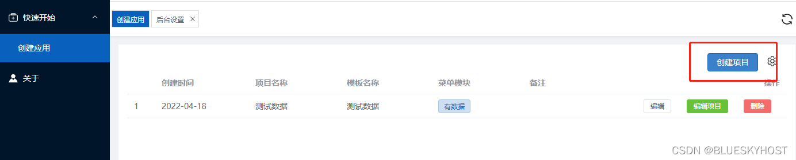
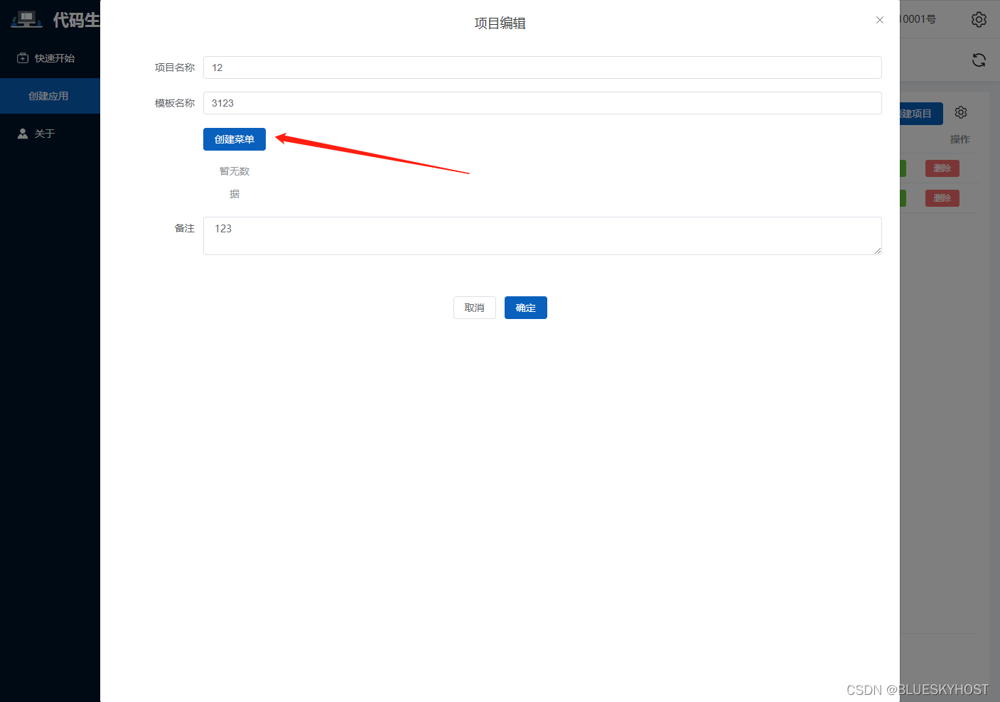
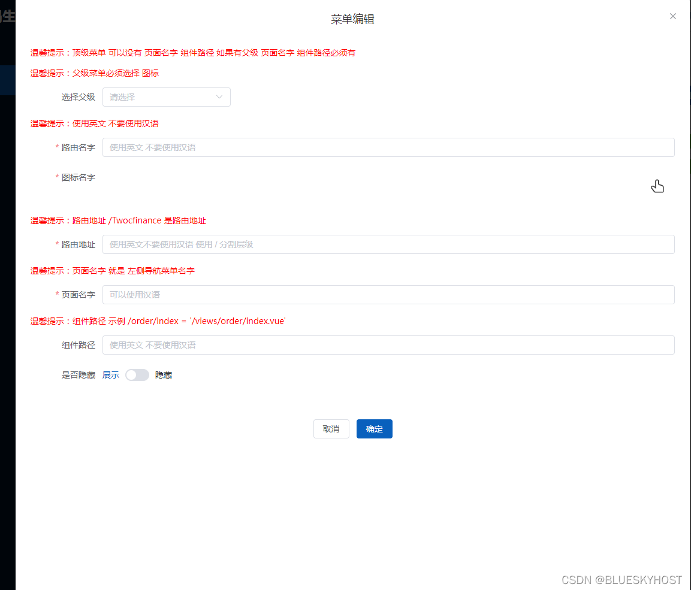
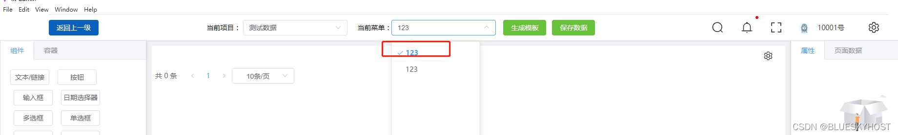
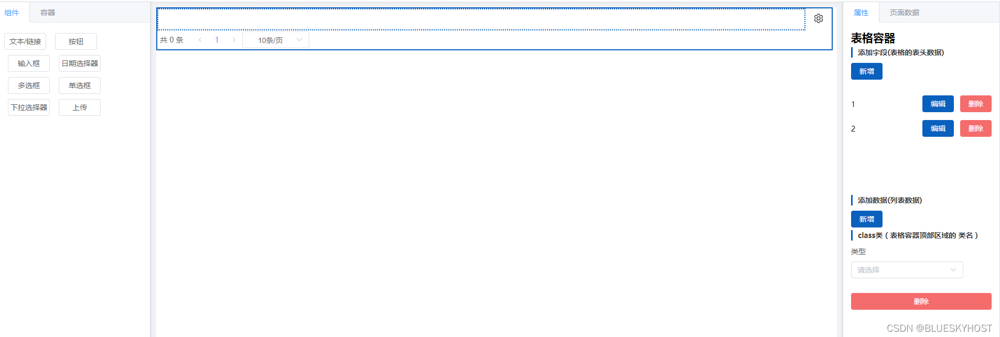

## 第二步：创建项目

### 1.点击创建项目 
> 输入完配置项后确认 项目名称 模板名称 备注

### 2.配置项目 
> 菜单模块是空数据 需要点击编辑按钮 进行配置项目菜单以及路由

### 3.点击创建菜单

### 4.点击绿色的编辑项目按钮

## 第三步：编辑项目页面布局

### 1.选择菜单  

### 2.编辑项目
>注意事项

1. 先选择布局容器
2. 组件容器必须放到布局容器里面
3. 新页面需要先拖拽布局容器 通常是表格布局
4. 页面数据 是当前菜单页面的数据 与开发同思想 先定义：变量名，函数，然后才可以绑定函数 以及变量名
5. 绑定变量 1.在页面数据先创建变量才可以选择变量 默认都是v-model 数据双向绑定  
### 3.容器/组件
1. 双击可以查看 容器或者组件所有 属性，激活是边框是实线选中状态

